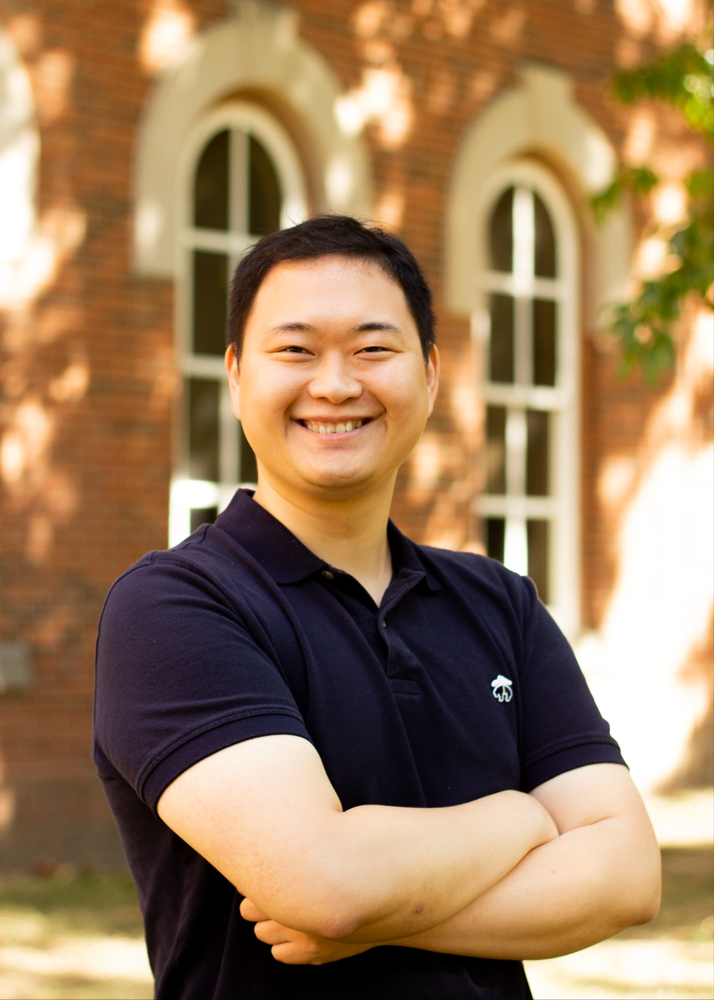
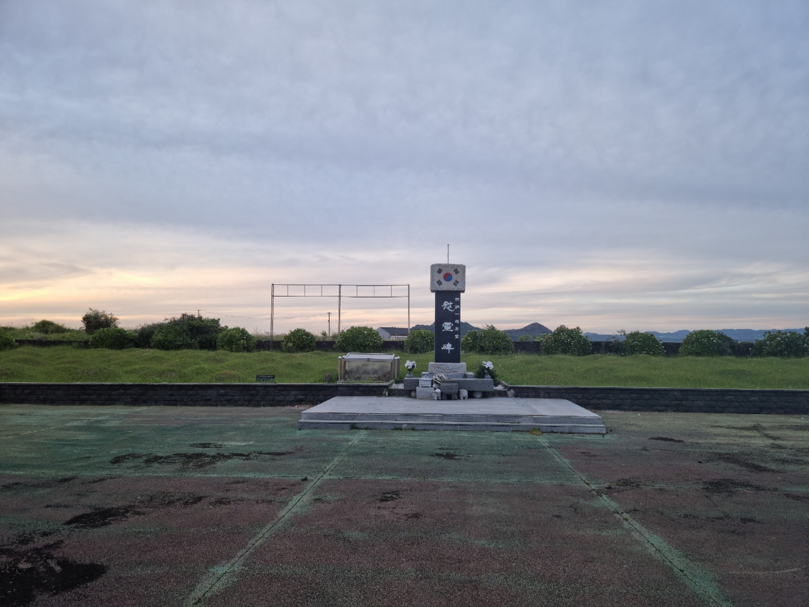
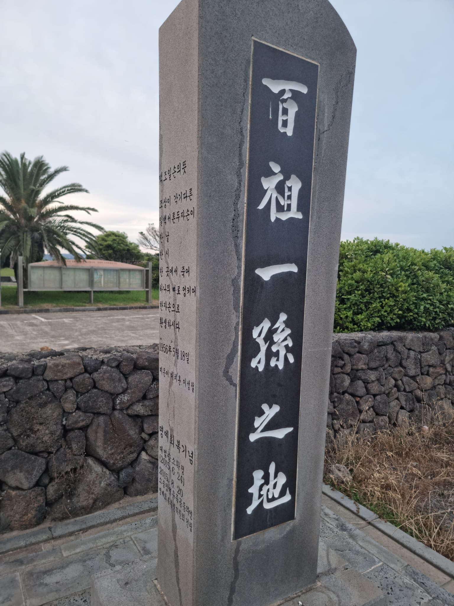

My name is Son, Woohun. I think it can be pronounced better by "Sohn, Wooheon".

I am a Ph.D. student in Economics at the Ohio State University (OSU), now. This blog is not my professional blog yet. But I might soon change it into such as soon as I have something to post for that, LOL.

I am interested in many things. Frankly speaking, I frequently get absorbed in things that intrigue me at a point in time. Diving deep into various subjects makes me unaware of the passage of time. However, as soon as the magic ends, I stop driving into those worlds and then precipitously forget about the subjects I once loved. That's why this blog is needed.

This is a blog that was built to archive, share, and introduce my personal interests and the content that I studied. I am interested in keyboards and fountain pens as hobbies and in economics and history as subjects of study right now.

The title of the blog 'Hundred Ancestors One Child' comes from the poem about a massacre of the series of the massacre --
which pertains to the Jeju 4.3 uprising
-- that was committed around 1950 in Jeju island. Since some portion of the slaughtered people were associated with communism or North Korea, the bereaved families in southwest Jeju could not excavate the bodies of the deceased officially until some years passed. When the remains were discovered, it was impossible to discern the identities because there was only one big chunk of bones. There must have been at least a hundred people. The two representatives of bereaved families, Lee, Chihoon, and Lee, Sungchul, suggested constructing one tombstone for the representative of 132 tombs, inscribed as "The Realm for a Child from Hundred Ancestors".

I was deeply impressed by humanism despite one of the most tragic scenes in the modern history of Korea. Not to lose this sort of warmth myself, I put it as the title of this blog. Let me translate the poem as follows : 

-The Way of a Child from Hundred Ancestors-

Hundred and thirty-two descendants

each from different ancestors

died on the same day,

same time and

same place,

mixed into a chunk of bones,

resurrected as one child.

May 18th 1956
written by Lee, Chihoon, and Lee, Sungchul

("Tombs and Monument for a Child from Hundred Ancestors" at 586-1, Sangmo-ri, Daejeong-eup, Seogwipo-si, Jeju-do, Republic of Korea)

(Tombstone wrote "The Realm for a Child from Hundred Ancestors". The poem is inscribed on the lateral side.)
